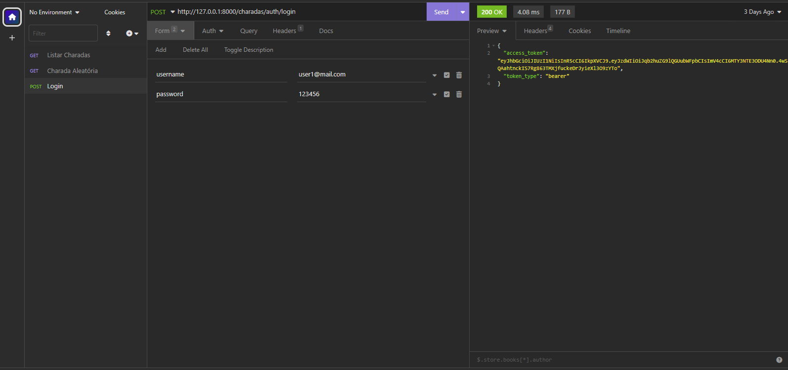
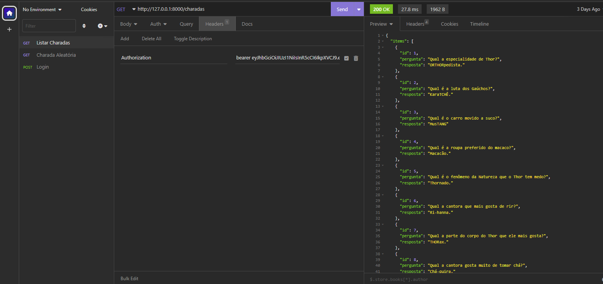

# API-Charadas

## 🗣️Introdução 

Charadas é uma API que traz uma piada/charada aleatória a cada consulta. Desenvolvi essa API baseada no repósitório do charadas do kvson, mas implementei outros endpoints e autenticação para manutenção. 

Créditos: https://github.com/kivson/charadas

## 🧾Instruções para o Uso:
## **Pré-requisitos:**
* Python
## **Instruções**:
* Clone este repositório 
```
git clone git@github.com:ewdemy/api-charadas.git
```
* Entre na pasta api-charadas 
```
cd api-charadas/
```
* Utilize o pip para baixar as dependências do projeto:

```
pip install -r requirements.txt
```

ou 

```
pip3 install -r requirements.txt
```

## Execução

Para executar o projeto, utilize o comando abaixo na raiz do projeto:

```
uvicorn main:app --reload 
```
* Feito isso sua aplicação estará rodando na porta :8000

## 📕 Documentação:

* A Documentação do projeto pode ser lida e realizada as ações em ```/docs``` ou ```/redoc```


## Licença ©️

Este projeto está sob a licença GNU General Public License v3.0.

[](https://www.gnu.org/licenses/gpl-3.0)

## Screenshots 📸




